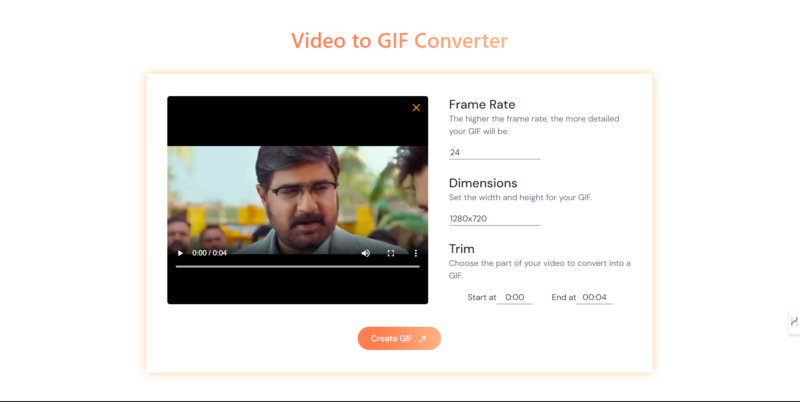

<h1 align="center">🎥 Video-To-GIF-Converter 🎥</h1>

## Overview

This Video-To-GIF-Converter web app is built using React.js and Express.js. It provides a simple and intuitive way to convert video files to GIFs. With an easy-to-use interface, you can quickly upload your video, set the start and end times, and generate a GIF from the selected portion. The app processes the video and allows you to download the resulting GIF with just one clicks. This tool is perfect for anyone looking to create GIFs from their favorite videos quickly and easily.

### UI 
 

## Setup Steps

- Clone the Repository

```
git clone https://github.com/DileepGhanta/Video-To-GIF-Converter.git
```
- Go to directory

```
cd Video-To-GIF-Converter
```
- Install node_modules 
```
npm install
```
- Install Dependency 
```
npm install @ffmpeg/core @ffmpeg/ffmpeg bootstrap cors express file-saver fluent-ffmpeg multer node-fetch react react-dom react-dropzone react-icons styled-components sweetalert
```
- Install ffmpeg 
```
Download ffmpeg from ffmpeg, install it for Windows, extract the folder, rename it to ffmpeg, copy the bin folder path, and add the path to environment variables.
```
- Start LocalHost Server & Express server
```
npm run dev
node server.js
```
